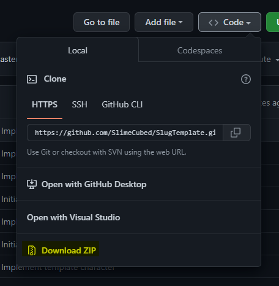
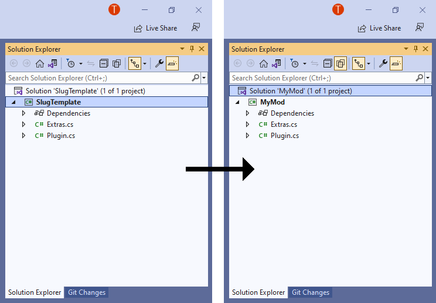
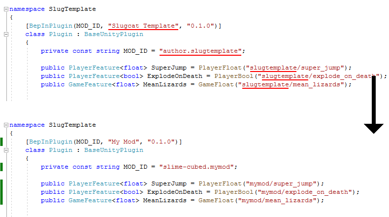
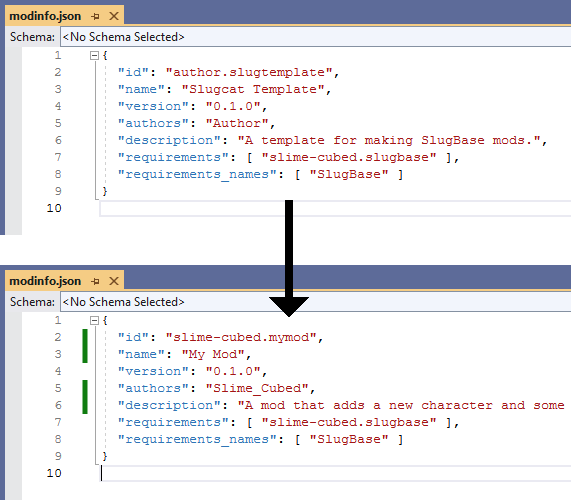
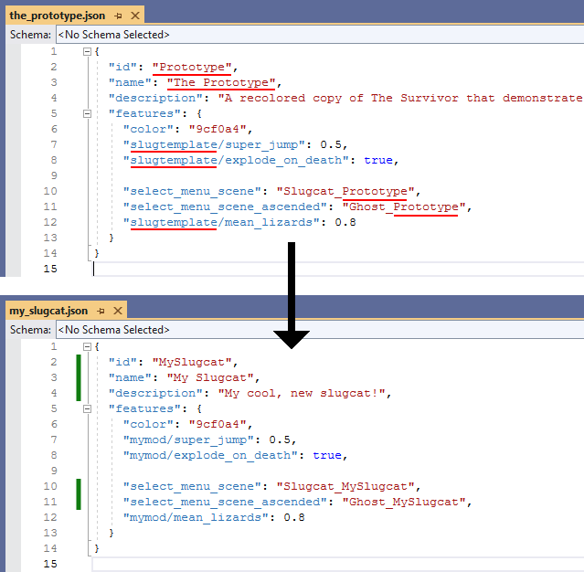
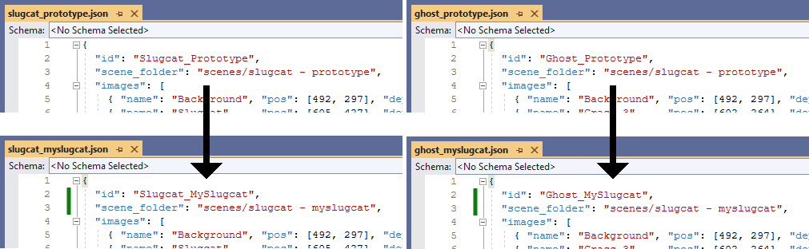
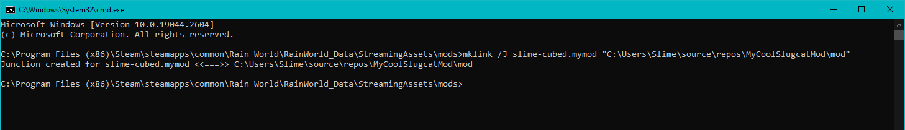

# SlugTemplate Walkthrough
This article takes you through the process of making a custom slugcat from a template project. If you already have a project set up, see [Getting Started](gettingstarted.md).

## Prerequisites
Before you start, you'll need a few things:
- [Visual Studio](https://visualstudio.microsoft.com/vs/community/) with the ".NET desktop development" workload to compile C# code into dlls.
- [SlugTemplate](https://github.com/SlimeCubed/SlugTemplate), either by creating a new GitHub repo with the template or downloading the source as a ZIP file.
- [dnSpy](https://github.com/dnSpy/dnSpy/releases/latest) to decompile and inspect the game's code.
- Some knowledge of C#.

## Setting Up
First things first, you'll need the code. Open [the template repo](https://github.com/SlimeCubed/SlugTemplate) in a web browser, click the Code button, and download the repo as a ZIP file.



It isn't important where you unzip this, but avoid putting it in the game's folder.

Once the contents are extracted, double-click `src\SlugTemplate.csproj` to open it with Visual Studio. You can try build it with Ctrl+B to verify that everything works. On success, the output window will state "1 succeeded".

## Renaming
This will produce a perfectly functional mod as is, but if more than one person tries to upload it they'll run into a problem: the mod ID they use is already taken! There are a few things you'll want to rename to stop this from happening.

1: In the Solution Explorer, right click on both the solution and project and select Rename. Enter a new name for your project. These do not need to be the same.



2: Open `Plugin.cs` in Visual Studio. Rename the mod name and ID to something unique. Update the prefixes on the custom feature names, as well. These fields are unrelated, but should be similar enough that you can identify them as being from your mod.



3: Open `mod\modinfo.json` in any text editor. Visual Studio works for this, and will notify you if your JSON formatting is invalid. The "id", "name", and "version" properties should match with what you've specified in `Plugin.cs`.



4: Edit `mod\slugbase\the_prototype.json` to your new slugcat's name and change its properties to match. Note that the file name here isn't important, but should generally match the slugcat ID so you know where to look if something goes wrong. You'll need to update the scene names in the next step, so also change their IDs in this file.



5: Edit `mod\slugbase\scenes\slugcat_prototype.json` and `ghost_prototype.json` to change the "id" properties to the same ones that you specified in your slugcat's json file. Change the "scene_folder" property to a new, unique path and rename the corresponding folders in `mod\scenes` accordingly. It isn't technically necessary to rename the JSON files themselves, but you still should to alleviate any confusion.



## Building and Playing Your Mod
Open up your project, then build via the Build menu or by entering Ctrl+B. This will generate a dll from your C# code and place it in `mod\plugins\`. With that, it's ready to try out!

Take the `mod` folder and copy it into the game's `mods` folder. If you're using Steam's default installation location, that's in `C:\Program Files (x86)\Steam\steamapps\common\Rain World\RainWorld_Data\StreamingAssets\mods`. I recommend renaming it after copying the files over. Open up the game, go into the Remix menu, and you should see your mod there: enable it and restart. If everything worked, then there will be a new slugcat added to the story mode menu!

## Setting Up a Symbolic Link (optional)
If you don't want to copy the mod folder over each time you build it, you can use a symbolic link instead. This is essentially putting the same folder in two places at once. Edits made to one side will be reflected in the other. Not only will your plugins automatically be updated, but any edits you make to the slugcat JSON while the game is running will automatically be saved!

In file explorer, navigate to the game's `mods` folder. Type "cmd" into the command bar and hit enter. To create the link, enter the following command:
```cmd
mklink /J mymod "C:\...\MyModFolder\mod"
```
Make sure to replace "mymod" with your mod name, and the path on the right with the `mod` folder that contains `modinfo.json`.



## Moving On
Now, this new slugcat that explodes when it dies, is hated by every lizard, and can leap tall buildings with a single bound is cool, but likely not what you had in mind for your custom slugcat. If what you're thinking is something simple, such as diet or stats changes, then it might be built into SlugBase as one of the [Built-In Features](features.md). More complex or unique features will need [Custom Features](custom-features.md). Some changes aren't within the scope of SlugBase, such as adding new levels—for those you can reference [The Modding Wiki](https://rainworldmodding.miraheze.org/wiki/Downpour_Reference/Modification_Files).